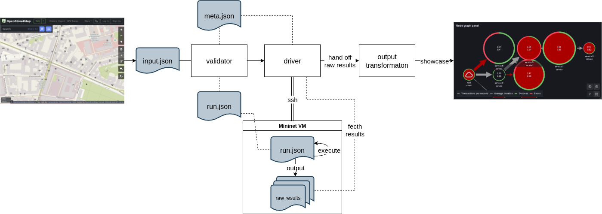
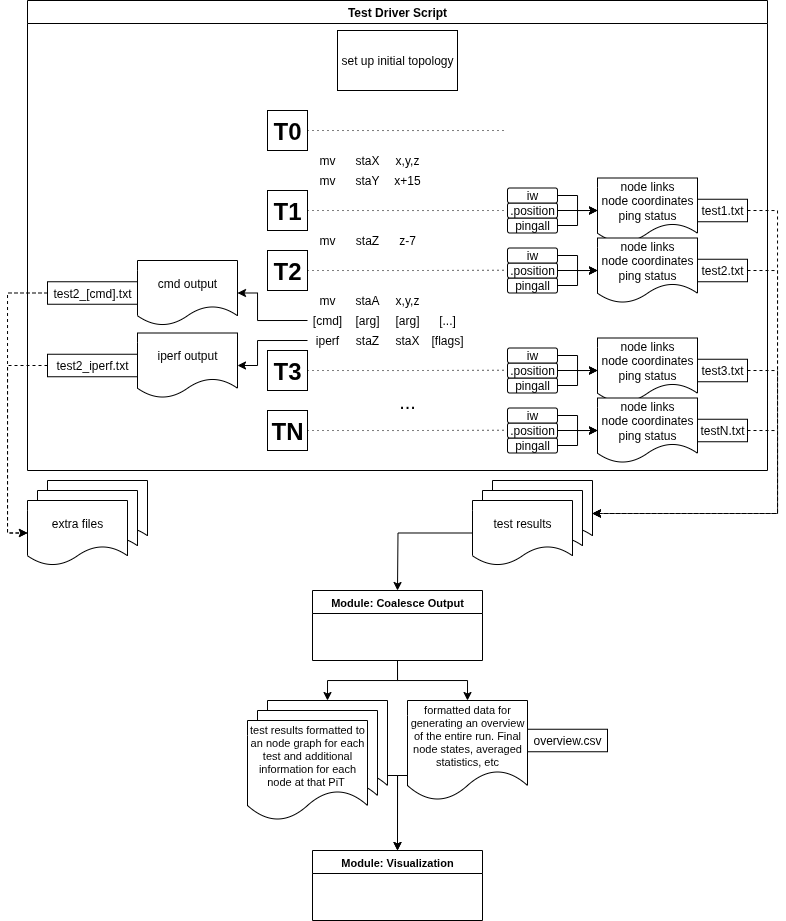

# Omen

A prototype modular pipeline for instrumenting network simulations and visualizing outcomes. Omen seeks to prove the feasibility of turning static, user inputs into usable test results that can be roughly applied to real life scenarios. As a prototype, Omen is *not* focused on accuracy or granularity so much as it is trialing available technologies to assess limitations, workarounds, and alternative options.

# Team Members

*Tech Team*
- Vaidehi Mehra
- Tiger Li
- Gavin Liao

*Project Manager* - Anna Bernsteiner

*Tech Lead* - Rory Landau

# This Repo

This repo contains the pipeline in full, a build system for both native binaries (via the standard Golang tooling) and Docker images, a push-button* user interface for executing the pipeline, example input and intermediary files for each module/stage in the pipeline, and a set of suggested inputs (with sourcing) for modeling specific weather conditions.

Each module strictly follows its [I/O contract](MODULE_CONTRACTS.md) to ensure proper cooperation.

*mostly push button; note the [dependencies](#dependencies) below.

# Building

## Dependencies

- Docker

- Go 1.25+
    - We are only using minimal functionality from 1.25; a downgrade to a prior major version would not be too burdensome.

- A Mininet_Wifi VM available over SSH

## Quick Start

Build all components by executing `mage` at repo root.

Execute coordinator with an input json file: `artefacts/coordinator <input>.json`.

## In Depth

[Mage](https://magefile.org/), the build system, is responsible for building each docker image, compiling each binary, and moving required files into an `artefacts` directory for ease-of-access.

Coordinator (`./artefacts/coordinator`) is responsible for executing each step and passing I/O between modules. Each module can be executed individually, if that is preferred (see [below](#running-manually) sections).

Under the hood, the Omen is a pipeline composed of disparate modules with their I/O chained together. See [Module Contracts](MODULE_CONTRACTS.md) for more information about each module's I/O expectations and results.

### Running Manually

You can also run each step manually, if preferred.

Start by running `mage` from the top-level `Omen` directory. All build artefacts can be found in `./artefacts`.

#### Input Validation

This module is responsible for, as it sounds, validating user input. The docker container expects a single json file to be provided. See the [example input file](example_files/0_input-good_user_test.json) and [module contracts file](MODULE_CONTRACTS.md) for formatting and parameters.

Run the validator with: `docker run --rm -v /path/to/user/input.json:/input/in.json 0_omen-input-validator:latest /input/in.json`

If this passes, the given file can be considered validated and ready for the rest of the pipeline.

#### Test Runner

This module is responsible for connecting to mininet, executing the test script, and pulling results back to the local machine for further processing.

Ensure your mininet vm is spinning and accessible over ssh via the u/p and address listed in the input json.

Run the test driver: `./artefacts/1_spawn /path/to/in.json`

#### Output Coercion

This module is responsible for transforming the the raw results from the test driver into usable input for the visualization module. Given a directory, this module will find the latest batch of results in the given path (by reading the timestamped subdirectories of the form YYYYMMDD_HHMMSS). It will coalesce the results into two files per timeframe, placing each file pair in a subdirectory for the timeframe `./results/timeframeX`.

Run output coercion: `./2_output_processing path/to/raw/results/directory/`.

Example:

Executing `./2_output_processing ./raw_results/` with this directory structure:

```
raw_results/
├── 20251027_214718/
│   ├── timeframe0.txt
│   ├── timeframe1.txt
│   ├── timeframe2.txt
│   └── timeframe3.txt
└── 20251023_204101/
    ├── timeframe0.txt
    └── timeframe1.txt
```

will transform `raw_results/20251027_214718/` into:

```
results/ 
├── timeframe0/ 
│   ├── nodes.csv 
│   └── edges.csv 
├── timeframe1/ 
│   ├── nodes.csv 
│   └── edges.csv 
├── timeframe2/ 
│   ├── nodes.csv 
│   └── edges.csv 
├── timeframe3/ 
│   ├── nodes.csv 
│   └── edges.csv 
├── final_iw_data.csv 
└── pingall_full_data.csv 
```

#### Visualization

**Limitation:** Each run of the visualizer expects a clean Grafana instance; as such, Docker containers and the sqlite database are created fresh each run.

##### 1. generate a sqlite3 database for Grafana to visualize.

From `Omen/modules/3_output_visualization` execute two commands:
```bash
python3 omenloader.py graph \
  --db <output path>.db \
  --recreate \
  --root <path/to/results> \
  --set1-prefix netA --set1-dir timeframe0 --set1-ts timeframe0/ping_data_movement_0.csv \
  --set2-prefix netB --set2-dir timeframe1 --set2-ts timeframe1/ping_data_movement_1.csv \
  --set3-prefix netC --set3-dir timeframe2 --set3-ts timeframe2/ping_data_movement_2.csv
```

- `--db=<output path>.db` can be any path; a database file will be created at that location.
- `--root=<path/to/results>` must be the path to the directory that looks like the results directory output by the [prior](#output-coercion) module. For example: `--root ../../example_files/2_output-result`

```bash
python3 omenloader.py timeseries \
  --root ../../example_files/2_output-result \
  --csv <filename>.csv \
  --db <output path>.db \
  --table ping_data \
  --if-exists replace \
  --aggregate-by movement_number
```

- `--csv=<filename>.csv` is the name of the file containing summary ping data (as opposed to ping data from a specific timeframe). **NOTE**: the path to this file is rooted by `--root`.

#### 2. spin up a Grafana docker container directed at the database.

Spool up the docker container, making sure to map the database created in the last step: `docker run -d -v ./<db output path>.db:/var/lib/grafana/data.db -p 3000:3000 3_omen-output-visualizer-grafana`

Finally, update the Dashboard.json file with the UID of the sqlite datasource in Grafana (access the datasource in the Grafana UI and copy the string after 'edit': `http://localhost:3000/connections/datasources/edit/<this string>`). Run: `sed -i 's/YOUR UID HERE/<sqlite datasource UID>/gI' timeframeX.json` against every timeframe.json file and the Dashboard.json file.

For example: `sed -i 's/YOUR UID HERE/P0CD8666848BF286D/gI' timeframe0.json`

Import a new dashboard and feed in Dashboard.json. Tada!

# Architectural Diagrams


## Milestone 2 Overview



## Milestone 3 Updated Test Driver Flow



>[!NOTE]
>Support for outputting extra files is theoretical and not currently supported.